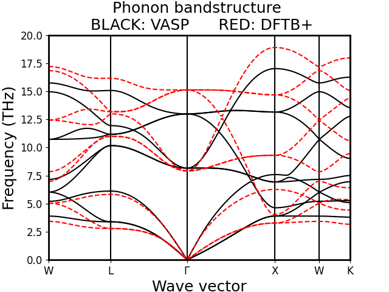
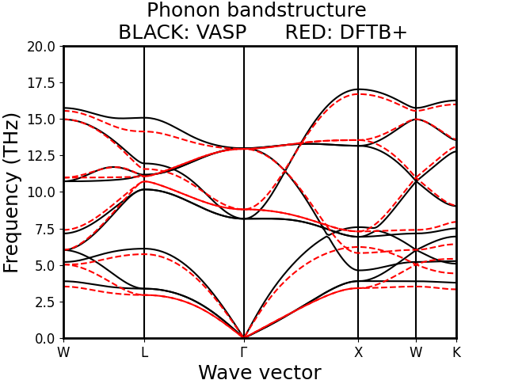

**************
Reference data
**************

Phonon spectra for the f-in-core and f-in-valence DFTB parameters from `Towards an efficient f-in-core/f-in-valence switchable description for DFTB calculations of Ce 4f states in ceria` 
in comparison to DFT calculated using VASP.

    Comparison of phonon spectra calculated with the f-in-core parametrized DFTB+ method and VASP. 

    Comparison of phonon spectra calculated with the f-in-valence parametrized DFTB+ method and VASP. 

